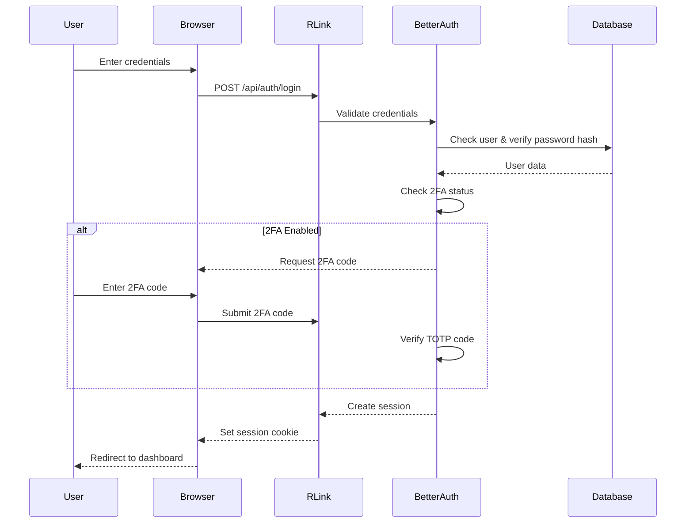

## Overview

RLink uses [Better Auth](https://www.better-auth.com/) for authentication, providing a secure, modern authentication system with support for:

- Email/Password authentication
- Two-Factor Authentication (2FA)
- Session management
- Password reset flow
- Account verification

## Authentication Flow



## Configuration

### Environment Variables

```bash
# Required for Better Auth
BETTER_AUTH_SECRET="your-random-32-char-secret"
NEXT_PUBLIC_APP_URL="https://your-domain.com"
BETTER_AUTH_URL="https://your-domain.com" # Optional fallback
DATABASE_URL="postgresql://..." # For session storage
```

### Better Auth Setup

Better Auth is wired through the Next.js App Router. In the [RLink repository](https://github.com/dazedmind/rlink), look for:

- A catch-all auth route under `app/api/auth/` (Better Auth’s usual pattern)
- Client helpers (for example `lib/auth-client.ts` or similar) used by the login and dashboard

Key features enabled:
- Email/Password authentication
- Session-based authentication
- Admin plugin for user management
- Two-Factor Authentication plugin

## User Authentication

### Login Process

Users can log in via the `/login` page:

1. **Enter Credentials**: Email and password
2. **2FA Check**: If 2FA is enabled, prompt for code
3. **Session Creation**: On success, create session cookie
4. **Redirect**: Send user to `/home` dashboard

### Session Management

Sessions are stored in the database and validated on each request.

**Session Duration**: Configured in Better Auth settings

**Session Storage**:
- Database table: `sessions` (Better Auth table)
- Cookie name: Set by Better Auth (typically `better-auth.session_token`)
- Cookie attributes: `HttpOnly`, `Secure` (in production), `SameSite=Lax`

### Protected Routes

Routes are protected using the `ProtectedRoute` component:

```typescript
// components/ProtectedRoute.tsx
'use client';

import { useAuth } from '@/lib/auth-client';
import { useRouter } from 'next/navigation';
import { useEffect } from 'react';

export function ProtectedRoute({ children }: { children: React.ReactNode }) {
  const { session, isLoading } = useAuth();
  const router = useRouter();

  useEffect(() => {
    if (!isLoading && !session) {
      router.push('/login');
    }
  }, [session, isLoading, router]);

  if (isLoading) {
    return <LoadingSpinner />;
  }

  if (!session) {
    return null;
  }

  return <>{children}</>;
}
```

**Usage**:
```typescript
// app/home/layout.tsx
import { ProtectedRoute } from '@/components/ProtectedRoute';

export default function HomeLayout({ children }) {
  return (
    <ProtectedRoute>
      {children}
    </ProtectedRoute>
  );
}
```

## Two-Factor Authentication (2FA)

### Setup Process

Users can enable 2FA in Settings → Privacy & Security:

<Steps>
  <Step title="Generate Secret">
    Server generates a TOTP secret for the user
  </Step>

  <Step title="Display QR Code">
    QR code is generated using `react-qr-code` for easy scanning
  </Step>

  <Step title="Verify Code">
    User enters code from authenticator app to confirm setup
  </Step>

  <Step title="Enable 2FA">
    2FA is enabled in database, backup codes generated
  </Step>
</Steps>

### 2FA Login Flow

When 2FA is enabled:

1. User enters email/password
2. Password validated successfully
3. System detects 2FA enabled
4. User prompted for 6-digit TOTP code
5. Code validated (30-second window)
6. Session created on success

### Supported Authenticator Apps

- Google Authenticator
- Microsoft Authenticator
- Authy
- 1Password
- Any TOTP-compatible app

### Backup Codes

Backup codes (if enabled in your Better Auth configuration) are typically issued when 2FA is first enabled so users can sign in without the authenticator app.

## Password Reset Flow

### Request Reset

1. User clicks "Forgot Password" on login page
2. Enters email address
3. System sends reset email via Resend
4. Email contains unique reset token (time-limited)

### Reset Password

1. User clicks link in email
2. Redirected to `/reset-password?token=xxx`
3. Enters new password (must meet strength requirements)
4. Password updated in database
5. All existing sessions invalidated
6. User redirected to login

### Email Template

Reset emails use the React Email template system:

```typescript
// templates/email/password-reset.tsx
import { Html, Head, Body, Container, Button } from '@react-email/components';

export default function PasswordResetEmail({ resetUrl }: { resetUrl: string }) {
  return (
    <Html>
      <Head />
      <Body>
        <Container>
          <h1>Reset Your Password</h1>
          <p>Click the button below to reset your password:</p>
          <Button href={resetUrl}>
            Reset Password
          </Button>
          <p>This link will expire in 1 hour.</p>
        </Container>
      </Body>
    </Html>
  );
}
```

## User Registration

### Admin-Only Registration

**Self-registration is disabled for security purposes** (as noted in changelog v0.0.8).

New users can only be created by administrators through the IAM module:

<Steps>
  <Step title="Admin Creates Account">
    Admin navigates to IAM → Users → Add User
  </Step>

  <Step title="Generate Password">
    System can auto-generate secure password
  </Step>

  <Step title="Send Welcome Email">
    User receives welcome email with credentials (since v0.0.14)
  </Step>

  <Step title="User Login">
    User logs in with provided credentials
  </Step>

  <Step title="Optional: Reset Password">
    User can change password in Settings
  </Step>
</Steps>

## Session Security

### Security Measures

<AccordionGroup>
  <Accordion title="Secure Cookies" icon="cookie">
    - `HttpOnly`: Prevents JavaScript access
    - `Secure`: HTTPS-only (production)
    - `SameSite=Lax`: CSRF protection
  </Accordion>

  <Accordion title="Password Hashing" icon="lock">
    Better Auth uses bcrypt for password hashing with appropriate salt rounds
  </Accordion>

  <Accordion title="Session Expiration" icon="clock">
    Sessions expire after period of inactivity (configured in Better Auth)
  </Accordion>

  <Accordion title="CSRF Protection" icon="shield">
    Built-in CSRF protection via SameSite cookies and session validation
  </Accordion>

  <Accordion title="Rate Limiting" icon="gauge">
    Login attempts should be rate-limited to reduce brute-force risk (configure in Better Auth or at the edge).
  </Accordion>
</AccordionGroup>

### Session Validation

Every API request validates the session:

```typescript
// Example middleware/API route
import { auth } from '@/lib/auth';

export async function GET(request: Request) {
  const session = await auth.api.getSession({
    headers: request.headers
  });
  
  if (!session) {
    return Response.json(
      { error: 'Unauthorized' },
      { status: 401 }
    );
  }
  
  // Proceed with authenticated request
  const userId = session.user.id;
  // ...
}
```

## Password Requirements

Based on the changelog (v0.0.9), the system includes password validation with strength meter:

**Requirements** (typical):
- Minimum 8 characters
- At least one uppercase letter
- At least one lowercase letter
- At least one number
- At least one special character

**Strength Indicator**:
- Weak: Minimum requirements only
- Medium: Good length, character variety
- Strong: Excellent length, high entropy

## API Endpoints

### POST /api/auth/login

Authenticate user and create session.

**Request**:
```json
{
  "email": "user@example.com",
  "password": "SecurePass123!"
}
```

**Response (no 2FA)**:
```json
{
  "user": {
    "id": "uuid",
    "email": "user@example.com",
    "name": "John Doe"
  },
  "session": {
    "token": "session_token",
    "expiresAt": "2026-04-30T00:00:00Z"
  }
}
```

**Response (2FA enabled)**:
```json
{
  "requiresTwoFactor": true,
  "message": "Enter 2FA code"
}
```

### POST /api/auth/verify-2fa

Verify 2FA code and complete login.

**Request**:
```json
{
  "email": "user@example.com",
  "code": "123456"
}
```

### POST /api/auth/logout

Terminate current session.

**Response**:
```json
{
  "message": "Logged out successfully"
}
```

### POST /api/auth/forgot-password

Request password reset email.

**Request**:
```json
{
  "email": "user@example.com"
}
```

### POST /api/auth/reset-password

Reset password with token.

**Request**:
```json
{
  "token": "reset_token_from_email",
  "password": "NewSecurePass123!"
}
```

## Client-Side Usage

### Using the auth client

Use the project’s generated Better Auth client (see `lib/` in the repo) for session state:

```typescript
'use client';

import { useAuth } from '@/lib/auth-client';

export function UserProfile() {
  const { session, user, signOut } = useAuth();

  if (!session) {
    return <div>Not logged in</div>;
  }

  return (
    <div>
      <p>Welcome, {user.name}</p>
      <button onClick={() => signOut()}>
        Logout
      </button>
    </div>
  );
}
```

### Checking Auth Status

```typescript
const { session, isLoading } = useAuth();

if (isLoading) {
  return <LoadingSpinner />;
}

if (!session) {
  return <LoginPrompt />;
}

return <AuthenticatedContent />;
```

## Best Practices

<CardGroup cols={2}>
  <Card title="Never Store Passwords" icon="ban">
    Always hash passwords, never store plaintext
  </Card>
  <Card title="Use HTTPS" icon="lock">
    Always use HTTPS in production for secure cookie transmission
  </Card>
  <Card title="Validate Sessions" icon="check">
    Validate session on every protected API request
  </Card>
  <Card title="Rotate Secrets" icon="rotate">
    Rotate `BETTER_AUTH_SECRET` periodically (invalidates all sessions)
  </Card>
</CardGroup>

## Troubleshooting

Common authentication issues and solutions are in [Troubleshooting — Authentication issues](/operations/troubleshooting#authentication-issues).

## Next Steps

<CardGroup cols={2}>
  <Card title="Architecture" icon="sitemap" href="/reference/architecture">
    IAM boundaries and data flow
  </Card>
  <Card title="Authorization" icon="shield-check" href="/auth/authorization-and-modules">
    Module access and `403` behavior
  </Card>
  <Card title="API overview" icon="shield" href="/api-reference/introduction">
    Sessions, CORS, and how routes are documented
  </Card>
  <Card title="Dashboard overview" icon="grid-2" href="/guides/dashboard-overview">
    Where users work after sign-in
  </Card>
</CardGroup>