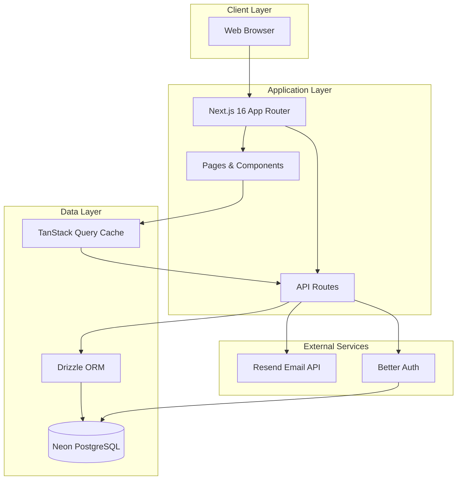
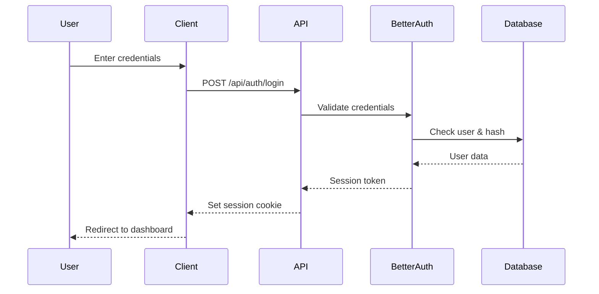
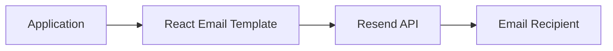

## High-Level Overview

RLink is built as a monolithic Next.js application using the App Router pattern, with clear separation between three main business domains: CMS, CRM, and IAM.



## Architecture Principles

<CardGroup cols={2}>
  <Card title="Server-First Approach" icon="server">
    API routes handle all business logic and database operations, keeping the client thin
  </Card>

  <Card title="Type Safety" icon="shield-check">
    End-to-end TypeScript with Drizzle ORM providing type-safe database queries
  </Card>

  <Card title="Separation of Concerns" icon="layer-group">
    Clear domain boundaries between CMS, CRM, and IAM modules
  </Card>

  <Card title="Performance Optimization" icon="gauge-high">
    TanStack Query for caching, lazy loading, and skeleton states
  </Card>
</CardGroup>

## Application Structure

### Directory Organization

```text
rlink/
├── app/                           # Next.js App Router
│   ├── api/                       # RESTful API Routes
│   │   ├── auth/                  # Authentication endpoints
│   │   ├── cms/                   # Content management APIs
│   │   ├── crm/                   # Customer relationship APIs
│   │   ├── iam/                   # Identity & access APIs
│   │   ├── cron/                  # Scheduled job endpoints
│   │   └── webhooks/              # External service webhooks
│   ├── home/                      # Authenticated application
│   │   ├── cms/                   # CMS module pages
│   │   ├── crm/                   # CRM module pages
│   │   ├── iam/                   # IAM module pages
│   │   └── settings/              # User settings pages
│   ├── login/                     # Public auth pages
│   ├── forgot-password/
│   └── reset-password/
├── components/                    # Shared UI components
│   ├── layout/                    # Layout components
│   ├── tables/                    # Data table components
│   ├── modals/                    # Dialog/modal components
│   └── ui/                        # shadcn/ui primitives
├── db/                            # Database layer
│   ├── schema.ts                  # Application tables
│   └── auth-schema.ts             # Better Auth tables
├── lib/                           # Business logic & utilities
│   ├── cms/                       # CMS domain logic
│   │   ├── types.ts              # TypeScript types
│   │   ├── queries.ts            # Database queries
│   │   └── cache.ts              # Cache helpers
│   ├── crm/                       # CRM domain logic
│   ├── iam/                       # IAM domain logic
│   └── email/                     # Email utilities
└── templates/email/               # React Email templates
```

## Data Flow

### 1. Client-Side Data Fetching

RLink uses TanStack Query for all client-side data fetching with centralized caching:

```typescript
// Centralized data fetching (once per module)
const { data, isLoading } = useQuery({
  queryKey: ['projects'],
  queryFn: async () => {
    const res = await fetch('/api/cms/projects');
    return res.json();
  },
  staleTime: 5 * 60 * 1000, // 5 minutes
});
```

**Benefits**:

- Eliminates redundant API calls when switching tabs
- Automatic background refetching
- Optimistic updates
- Stale data invalidation

### 2. API Route Pattern

All API routes follow a consistent RESTful pattern:

```text
GET    /api/{module}/{resource}           # List all
GET    /api/{module}/{resource}/[id]      # Get one
POST   /api/{module}/{resource}           # Create
PATCH  /api/{module}/{resource}/[id]      # Update
DELETE /api/{module}/{resource}/[id]      # Delete
```

### 3. Database Access

Drizzle ORM provides type-safe database queries:

```typescript
// Type-safe query with Drizzle
const projects = await db
  .select()
  .from(projectsTable)
  .where(eq(projectsTable.status, 'active'))
  .limit(10);
```

## Module Breakdown

### Content Management System (CMS)

**Purpose**: Manage website content, projects, careers, and articles

**Key Features**:

- Project CRUD with photo galleries
- Markdown article editor
- SEO optimization tools
- Analytics integration

**Database Tables**:

- `projects`
- `project_galleries`
- `amenities`
- `careers`
- `articles`

### Customer Relationship Management (CRM)

**Purpose**: Track leads, reservations, inquiries, and marketing campaigns

**Key Features**:

- Lead tracking with filtering
- Reservation management
- Inquiry inbox
- Newsletter campaigns
- DSL (Document Status) tracker

**Database Tables**:

- `leads`
- `reservations`
- `inquiries`
- `newsletters`
- `campaigns`
- `inventory`

### Identity & Access Management (IAM)

**Purpose**: User management, access control, and audit logging

**Key Features**:

- User lifecycle management
- Role-based access control
- Module-level permissions
- Activity audit logs
- 2FA support

**Database Tables**:

- `users` (Better Auth)
- `sessions` (Better Auth)
- `module_access`
- `activity_logs`
- `departments`

## Security Architecture

### Authentication Flow



### Protected Routes

1. **Client-Side Protection**: `ProtectedRoute` component wraps dashboard pages
2. **API Protection**: Middleware validates session on every API call
3. **CORS Configuration**: `ALLOWED_ORIGIN` environment variable controls cross-origin requests

### Security Layers

<AccordionGroup>
  <Accordion title="Rate Limiting" icon="gauge">
    Server-side rate limiting prevents API abuse and brute-force attempts.

    Rate limiting is likely implemented in API routes or middleware to throttle excessive requests.
  </Accordion>

  <Accordion title="Session Management" icon="clock">
    Better Auth manages secure session tokens with automatic expiration and refresh.
  </Accordion>

  <Accordion title="Two-Factor Authentication" icon="mobile">
    TOTP-based 2FA using authenticator apps for enhanced account security.
  </Accordion>

  <Accordion title="Activity Logging" icon="list-check">
    All user actions are logged with automatic 90-day retention policy via cron job.
  </Accordion>
</AccordionGroup>

## Email Architecture

### Email Flow



### Email Templates

Located in `templates/email/`:

- **Welcome Email**: Sent to new users upon account creation
- **Password Reset**: Sent when users request password reset
- **Campaign Email**: Marketing and newsletter emails

### Email Integration

```typescript
import { Resend } from 'resend';
import WelcomeEmail from '@/templates/email/welcome';

const resend = new Resend(process.env.RESEND_API_KEY);

await resend.emails.send({
  from: process.env.RESEND_FROM,
  to: user.email,
  subject: 'Welcome to RLink',
  react: WelcomeEmail({ userName: user.name }),
});
```

## Performance Optimizations

### 1. Centralized Data Fetching

Data is fetched once per module and cached, eliminating spinners on tab switches.

### 2. Server-Side Pagination

Default limit of 10 records per request reduces memory overhead and response latency.

### 3. Lazy Loading

Dashboard skeleton loaders provide immediate visual feedback while data loads.

### 4. Image Optimization

- Next.js Image component for automatic optimization
- Thumbnail generation for galleries
- Quality optimization for performance

### 5. Query Caching

TanStack Query cache with 5-minute stale time reduces redundant database queries.

## Deployment Architecture

### Vercel Deployment

RLink is deployed on Vercel with the following configuration:

```json
{
  "crons": [
    {
      "path": "/api/cron/activity-logs-retention",
      "schedule": "0 0 * * *"
    }
  ]
}
```

**Cron Jobs**:

- **Activity Log Retention**: Daily cleanup of logs older than 90 days

### Environment Configuration

Production environment requires:

- `ALLOWED_ORIGIN` set to actual production domain
- `NEXT_PUBLIC_APP_URL` matching deployed URL
- `CRON_SECRET` for secure cron execution
- All database and email credentials

## Scaling Considerations

<Warning>
  The following scaling considerations are based on typical Next.js application patterns and may require validation for this specific implementation.
</Warning>

<CardGroup cols={2}>
  <Card title="Database Scaling" icon="database">
    Neon PostgreSQL supports automatic scaling. Consider connection pooling for high traffic.
  </Card>

  <Card title="CDN Integration" icon="network-wired">
    Vercel provides global CDN. Static assets are automatically cached at edge locations.
  </Card>

  <Card title="API Caching" icon="memory">
    Implement Redis or similar for API response caching if needed for high traffic.
  </Card>

  <Card title="Background Jobs" icon="gears">
    Consider queue system (Bull, BullMQ) for heavy operations instead of API routes.
  </Card>
</CardGroup>

## Technology Decisions

### Why Next.js 16 App Router?

- Server Components reduce client bundle size
- Built-in API routes eliminate separate backend
- Excellent TypeScript support
- Vercel deployment optimization

### Why Drizzle ORM?

- Type-safe queries with TypeScript
- Lightweight compared to TypeORM/Prisma
- SQL-like syntax familiar to developers
- Excellent migration tooling

### Why Better Auth?

- Simple setup compared to NextAuth
- Built-in 2FA support
- Admin plugin for user management
- Session management out of the box

### Why TanStack Query?

- Automatic caching and refetching
- Optimistic updates
- Better developer experience than SWR
- Excellent TypeScript support

## Next Steps

<CardGroup cols={2}>
  <Card title="Database schema" icon="database" href="/reference/database-schema">
    Explore tables and relationships
  </Card>

  <Card title="Proxy and request flow" icon="shuffle" href="/reference/proxy-and-request-flow">
    See how auth, cookies, and CORS enter the app
  </Card>

  <Card title="REST API reference" icon="code" href="/api-reference/overview">
    Review HTTP endpoints
  </Card>

  <Card title="Domain libraries" icon="layer-group" href="/guides/domain-libraries">
    Understand `lib/cms`, `lib/crm`, `lib/iam`, and `lib/email`
  </Card>

  <Card title="Deployment" icon="server" href="/guides/deployment">
    Production and environment setup
  </Card>
</CardGroup>