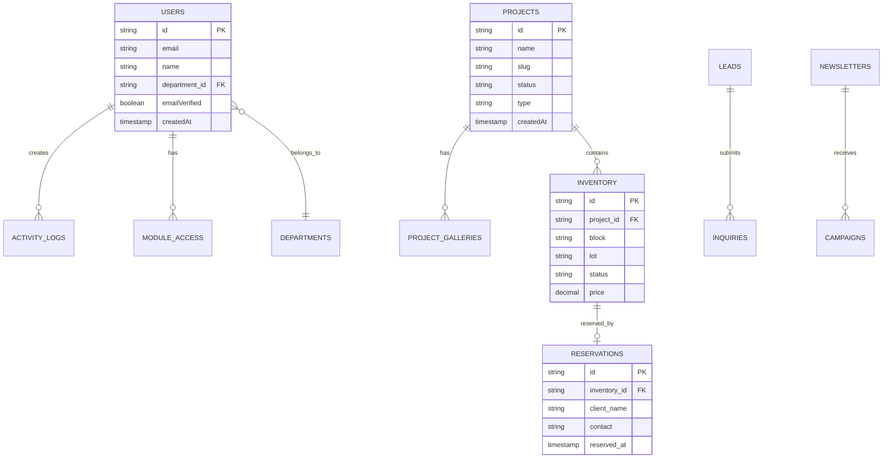

## Overview

RLink uses PostgreSQL (hosted on Neon) with Drizzle ORM for type-safe database operations. The schema is organized into three main domains:

<CardGroup cols={3}>
  <Card title="CMS Tables" icon="newspaper">
    Content, projects, articles, careers
  </Card>
  <Card title="CRM Tables" icon="users">
    Leads, reservations, inquiries, campaigns
  </Card>
  <Card title="IAM Tables" icon="shield">
    Users, sessions, access control, logs
  </Card>
</CardGroup>

## Schema Files

The database schema is split across two files:

- **`db/schema.ts`**: Application-specific tables (CMS, CRM, IAM)
- **`db/auth-schema.ts`**: Better Auth tables (users, sessions, etc.)

## Entity Relationship Diagram



## CMS Tables

### Projects

Stores property development projects.

| Column | Type | Description |
|--------|------|-------------|
| `id` | UUID | Primary key |
| `name` | VARCHAR | Project name |
| `slug` | VARCHAR | URL-friendly identifier |
| `description` | TEXT | Project description |
| `status` | ENUM | `active`, `upcoming`, `completed`, `on-hold` |
| `type` | ENUM | `residential`, `commercial`, `mixed-use` |
| `stage` | ENUM | `pre-selling`, `selling`, `sold-out`, `under-construction` |
| `location` | TEXT | Physical address |
| `coordinates` | JSON | Latitude/longitude |
| `nearby_landmarks` | JSON | Array of nearby places |
| `amenities` | JSON | Array of amenity IDs |
| `price_range` | JSON | `{ min, max }` pricing |
| `cover_photo` | VARCHAR | Cover image URL |
| `seo_title` | VARCHAR | SEO meta title |
| `seo_description` | TEXT | SEO meta description |
| `seo_keywords` | TEXT | Comma-separated keywords |
| `published` | BOOLEAN | Visibility status |
| `publish_date` | TIMESTAMP | Publication date |
| `created_at` | TIMESTAMP | Creation timestamp |
| `updated_at` | TIMESTAMP | Last update timestamp |

**Enums**:
```typescript
status: 'active' | 'upcoming' | 'completed' | 'on-hold'
type: 'residential' | 'commercial' | 'mixed-use'
stage: 'pre-selling' | 'selling' | 'sold-out' | 'under-construction'
```

### Project Galleries

Photo galleries for projects.

| Column | Type | Description |
|--------|------|-------------|
| `id` | UUID | Primary key |
| `project_id` | UUID | Foreign key → `projects.id` |
| `image_url` | VARCHAR | Image file URL |
| `caption` | TEXT | Image caption |
| `display_order` | INTEGER | Sort order |
| `house_model` | VARCHAR | Associated model (optional) |
| `created_at` | TIMESTAMP | Upload timestamp |

### Amenities

Property amenities catalog.

| Column | Type | Description |
|--------|------|-------------|
| `id` | UUID | Primary key |
| `name` | VARCHAR | Amenity name |
| `description` | TEXT | Description |
| `icon` | VARCHAR | Icon identifier |
| `cover_photo` | VARCHAR | Cover image URL |
| `category` | VARCHAR | Amenity category |
| `created_at` | TIMESTAMP | Creation timestamp |

### Careers

Job postings.

| Column | Type | Description |
|--------|------|-------------|
| `id` | UUID | Primary key |
| `title` | VARCHAR | Job title |
| `slug` | VARCHAR | URL-friendly identifier |
| `department` | ENUM | Department (see [Departments](#departments)) |
| `description` | TEXT | Job description (Markdown) |
| `requirements` | TEXT | Job requirements (Markdown) |
| `location` | VARCHAR | Work location |
| `employment_type` | ENUM | `full-time`, `part-time`, `contract` |
| `salary_range` | JSON | `{ min, max, currency }` |
| `published` | BOOLEAN | Visibility status |
| `publish_date` | TIMESTAMP | Publication date |
| `created_at` | TIMESTAMP | Creation timestamp |
| `updated_at` | TIMESTAMP | Last update timestamp |

### Articles

News articles and announcements.

| Column | Type | Description |
|--------|------|-------------|
| `id` | UUID | Primary key |
| `title` | VARCHAR | Article title |
| `slug` | VARCHAR | URL-friendly identifier |
| `content` | TEXT | Article content (Markdown) |
| `excerpt` | TEXT | Short summary |
| `type` | ENUM | `news`, `announcement`, `blog` |
| `cover_image` | VARCHAR | Cover image URL |
| `author_id` | UUID | Foreign key → `users.id` |
| `tags` | TEXT[] | Array of tags |
| `published` | BOOLEAN | Visibility status |
| `publish_date` | TIMESTAMP | Publication date |
| `seo_title` | VARCHAR | SEO meta title |
| `seo_description` | TEXT | SEO meta description |
| `created_at` | TIMESTAMP | Creation timestamp |
| `updated_at` | TIMESTAMP | Last update timestamp |

## CRM Tables

### Leads

Potential customer leads.

| Column | Type | Description |
|--------|------|-------------|
| `id` | UUID | Primary key |
| `first_name` | VARCHAR | First name |
| `last_name` | VARCHAR | Last name |
| `email` | VARCHAR | Email address |
| `phone` | VARCHAR | Phone number |
| `source` | ENUM | `website`, `referral`, `event`, `social` |
| `status` | ENUM | `new`, `contacted`, `qualified`, `converted`, `lost` |
| `interest` | TEXT | Areas of interest |
| `notes` | TEXT | Internal notes |
| `assigned_to` | UUID | Foreign key → `users.id` |
| `created_at` | TIMESTAMP | Lead creation time |
| `updated_at` | TIMESTAMP | Last update time |

### Reservations

Property unit reservations.

| Column | Type | Description |
|--------|------|-------------|
| `id` | UUID | Primary key |
| `inventory_id` | UUID | Foreign key → `inventory.id` |
| `project_name` | VARCHAR | Project reference |
| `client_name` | VARCHAR | Client full name |
| `contact_number` | VARCHAR | Client phone |
| `email` | VARCHAR | Client email |
| `reservation_date` | TIMESTAMP | Reservation timestamp |
| `status` | ENUM | `pending`, `confirmed`, `cancelled` |
| `payment_status` | ENUM | `unpaid`, `partial`, `paid` |
| `notes` | TEXT | Additional notes |
| `created_by` | UUID | Foreign key → `users.id` |
| `created_at` | TIMESTAMP | Record creation time |
| `updated_at` | TIMESTAMP | Last update time |

### Inventory

Property unit inventory.

| Column | Type | Description |
|--------|------|-------------|
| `id` | UUID | Primary key |
| `project_id` | UUID | Foreign key → `projects.id` |
| `inventory_code` | VARCHAR | Auto-generated code (e.g., "AR-B1-L5") |
| `block` | VARCHAR | Block number |
| `lot` | VARCHAR | Lot number |
| `house_model` | VARCHAR | Model type |
| `floor_area` | DECIMAL | Square meters |
| `lot_area` | DECIMAL | Square meters |
| `price` | DECIMAL | Unit price |
| `status` | ENUM | `available`, `reserved`, `sold` |
| `sold_to` | UUID | Foreign key → `reservations.id` (nullable) |
| `created_at` | TIMESTAMP | Record creation time |
| `updated_at` | TIMESTAMP | Last update time |

**Inventory Code Format**: `{ProjectInitials}-{Block}-{Lot}`
- Example: "AR-B1-L5" for Arcoe Residence, Block 1, Lot 5

### Inquiries

Customer inquiry inbox.

| Column | Type | Description |
|--------|------|-------------|
| `id` | UUID | Primary key |
| `name` | VARCHAR | Inquirer name |
| `email` | VARCHAR | Email address |
| `phone` | VARCHAR | Phone number |
| `subject` | VARCHAR | Inquiry subject |
| `message` | TEXT | Inquiry message |
| `status` | ENUM | `unread`, `read`, `responded`, `closed` |
| `responded_by` | UUID | Foreign key → `users.id` |
| `response` | TEXT | Admin response |
| `created_at` | TIMESTAMP | Inquiry timestamp |
| `updated_at` | TIMESTAMP | Last update time |

### Newsletters

Newsletter subscriptions.

| Column | Type | Description |
|--------|------|-------------|
| `id` | UUID | Primary key |
| `email` | VARCHAR | Subscriber email |
| `name` | VARCHAR | Subscriber name (optional) |
| `status` | ENUM | `subscribed`, `unsubscribed` |
| `subscribed_at` | TIMESTAMP | Subscription timestamp |
| `unsubscribed_at` | TIMESTAMP | Unsubscription timestamp |

### Campaigns

Marketing email campaigns.

| Column | Type | Description |
|--------|------|-------------|
| `id` | UUID | Primary key |
| `name` | VARCHAR | Campaign name |
| `subject` | VARCHAR | Email subject |
| `content` | TEXT | Email content (Markdown) |
| `recipients` | TEXT[] | Array of emails or "all" |
| `status` | ENUM | `draft`, `scheduled`, `sent` |
| `scheduled_at` | TIMESTAMP | Send time (nullable) |
| `sent_at` | TIMESTAMP | Actual send time |
| `created_by` | UUID | Foreign key → `users.id` |
| `created_at` | TIMESTAMP | Creation timestamp |
| `updated_at` | TIMESTAMP | Last update time |

### DSL Tracker

Document Status List tracking.

| Column | Type | Description |
|--------|------|-------------|
| `id` | UUID | Primary key |
| `client_name` | VARCHAR | Client name |
| `project` | VARCHAR | Project reference |
| `document_type` | VARCHAR | Type of document |
| `status` | ENUM | `pending`, `submitted`, `approved`, `rejected` |
| `submission_date` | TIMESTAMP | Submission timestamp |
| `notes` | TEXT | Tracking notes |
| `created_at` | TIMESTAMP | Record creation time |
| `updated_at` | TIMESTAMP | Last update time |

## IAM Tables

### Users (Better Auth)

User accounts managed by Better Auth.

| Column | Type | Description |
|--------|------|-------------|
| `id` | UUID | Primary key |
| `email` | VARCHAR | Email address (unique) |
| `emailVerified` | BOOLEAN | Email verification status |
| `name` | VARCHAR | Display name |
| `image` | VARCHAR | Profile image URL |
| `department_id` | UUID | Foreign key → `departments.id` |
| `createdAt` | TIMESTAMP | Account creation time |
| `updatedAt` | TIMESTAMP | Last update time |

<Note>
  Additional Better Auth tables include `sessions`, `accounts`, `verifications`, and `twoFactor`. See Better Auth documentation for details.
</Note>

### Departments

Company departments for user organization.

| Column | Type | Description |
|--------|------|-------------|
| `id` | UUID | Primary key |
| `name` | VARCHAR | Department name |
| `description` | TEXT | Department description |
| `created_at` | TIMESTAMP | Creation timestamp |

**Standard Departments** (based on CHANGELOG):
```typescript
// Actual departments vary - check db/schema.ts for current enum
departments: 
  | 'Executive'
  | 'Sales'
  | 'Marketing'
  | 'Operations'
  | 'Finance'
  | 'IT'
  | 'HR'
  // ... etc
```

### Module Access

Granular module-level permissions.

| Column | Type | Description |
|--------|------|-------------|
| `id` | UUID | Primary key |
| `user_id` | UUID | Foreign key → `users.id` |
| `module` | ENUM | `cms`, `crm`, `iam`, `settings` |
| `can_read` | BOOLEAN | Read permission |
| `can_write` | BOOLEAN | Write permission |
| `can_delete` | BOOLEAN | Delete permission |
| `created_at` | TIMESTAMP | Creation timestamp |
| `updated_at` | TIMESTAMP | Last update time |

### Activity Logs

Audit trail for user actions.

| Column | Type | Description |
|--------|------|-------------|
| `id` | UUID | Primary key |
| `user_id` | UUID | Foreign key → `users.id` |
| `action` | VARCHAR | Action type (e.g., "create", "update", "delete") |
| `module` | VARCHAR | Affected module |
| `resource` | VARCHAR | Affected resource type |
| `resource_id` | UUID | Affected resource ID |
| `changes` | JSON | Before/after snapshot |
| `ip_address` | VARCHAR | Request IP address |
| `user_agent` | TEXT | Browser user agent |
| `created_at` | TIMESTAMP | Action timestamp |

**Retention Policy**: Logs older than 90 days are automatically deleted via daily cron job.

## Relationships

### One-to-Many

- `users` → `activity_logs`: A user creates many activity logs
- `users` → `module_access`: A user has many module access permissions
- `projects` → `project_galleries`: A project has many gallery images
- `projects` → `inventory`: A project contains many units
- `users` → `articles`: A user authors many articles

### Many-to-One

- `inventory` → `projects`: Many units belong to one project
- `reservations` → `inventory`: Many reservations link to inventory
- `users` → `departments`: Many users belong to one department

### Optional Relationships

- `inventory.sold_to` → `reservations.id`: Inventory linked to reservation (nullable)
- `leads.assigned_to` → `users.id`: Lead assigned to user (nullable)
- `inquiries.responded_by` → `users.id`: Inquiry handled by user (nullable)

## Migrations

### Managing Schema Changes

1. **Edit schema files**: Modify `db/schema.ts` or `db/auth-schema.ts`
2. **Generate migration**: `npx drizzle-kit generate`
3. **Review migration**: Check generated SQL in `drizzle/` directory
4. **Apply migration**: `npx drizzle-kit migrate`

### Migration Files

Located in `drizzle/` directory with timestamp prefixes:
```
drizzle/
├── 0000_initial_schema.sql
├── 0001_add_departments.sql
├── 0002_add_module_access.sql
└── ...
```

<Warning>
  Always review generated migrations before applying to production. Drizzle Kit generates SQL based on schema changes, but complex migrations may require manual adjustments.
</Warning>

## Indexes

Common indexes for performance often include:

- Email fields (for lookups)
- Foreign keys (for joins)
- Status fields (for filtering)
- Created/updated timestamps (for sorting)

Check `db/schema.ts` for actual index definitions.

## Next Steps

<CardGroup cols={2}>
  <Card title="REST API reference" icon="code" href="/api-reference/overview">
    Explore database operations via API
  </Card>
  <Card title="Drizzle ORM docs" icon="book" href="https://orm.drizzle.team/docs/overview">
    Query API and migration guides
  </Card>
</CardGroup>